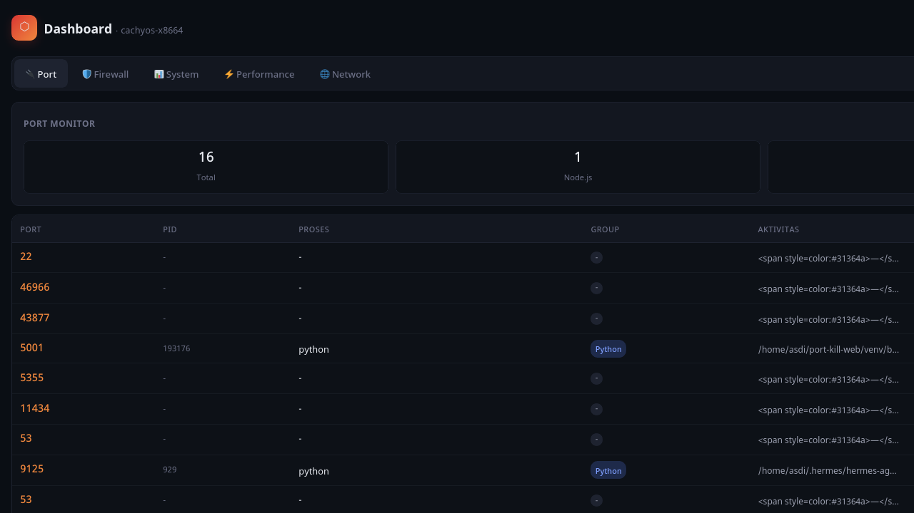
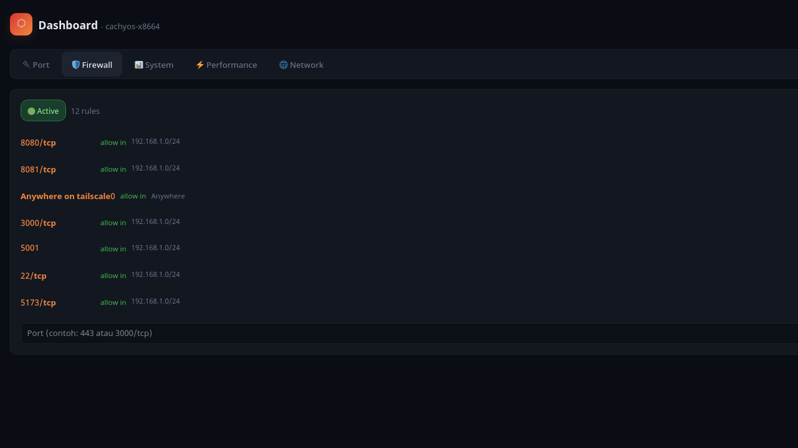
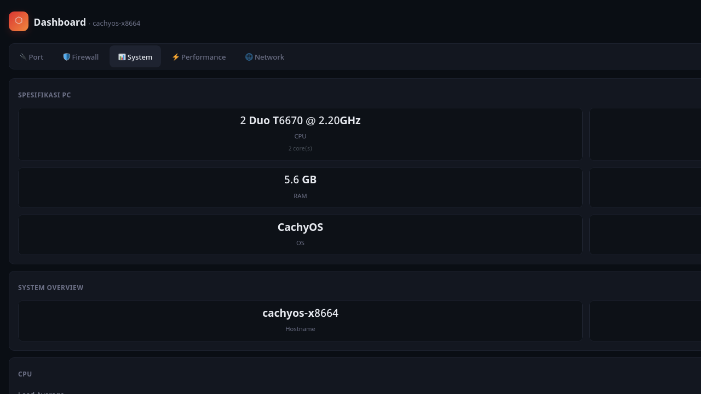
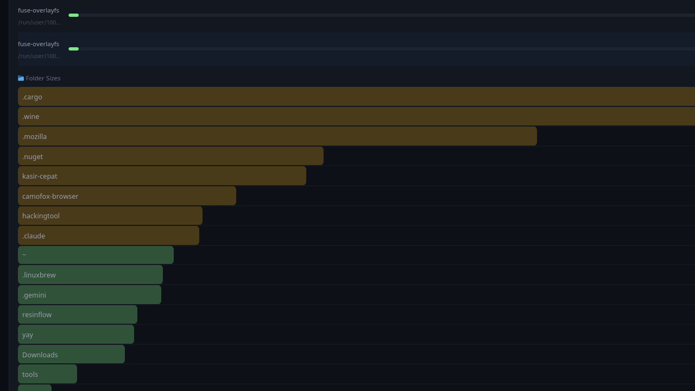
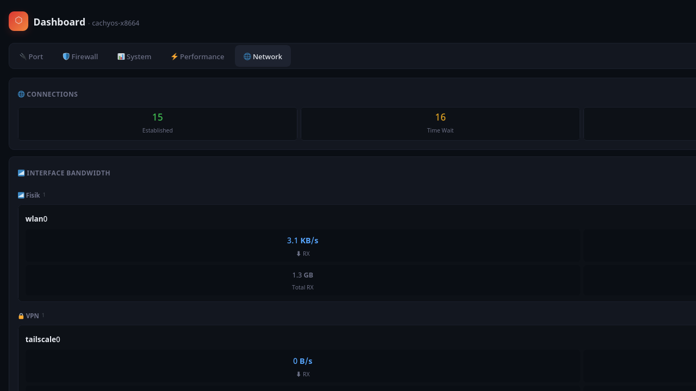

# System Dashboard All-in-One

Dashboard monitoring server real-time berbasis Flask.



## Fitur

| Tab | Fitur |
|-----|-------|
| 🔌 Port | Daftar port listening + kill button |
| 🛡️ Firewall | Status UFW + rules + add/delete |
| 📊 System | CPU (real-time delta), RAM, Disk, Load Average, Suhu, Disk Analyzer drill-down |
| ⚡ Performance | CPU hogs, Memory top, Services control |
| 🌐 Network | Bandwidth per interface (grup: Fisik/VPN/Docker), Connection states |

## Screenshots

### 🔌 Port Monitor


### 🛡️ Firewall


### 📊 System



### ⚡ Performance


### 🌐 Network



## Teknis

- **Stack:** Flask + vanilla JS + CSS (dark theme, mobile-first)
- **Realtime:** Server-Sent Events (SSE), update tiap 5 detik
- **Modular:** `modules/` — state, helpers, ports, firewall, system, performance, disk, network
- **Idle-aware:** Scanner loop otomatis tidur saat gak ada yg buka web (0% CPU)
- **Viewer count:** Unique IP — refresh gak nambahin hitungan

## Cara jalankan

```bash
git clone https://github.com/asdiayu/system-dashboard.git
cd system-dashboard
python3 -m venv venv
source venv/bin/activate
pip install flask
python app.py
```

Buka `http://localhost:5001`

## Struktur

```
port-kill-web/
├── app.py              # Entry point: routes, scanner loop, SSE stream
├── templates/index.html
├── static/
│   ├── style.css
│   └── app.js
├── screenshots/        # Screenshot preview
└── modules/
    ├── state.py        # Shared state & threading locks
    ├── helpers.py      # run(), get_specs()
    ├── ports.py        # Port scan & kill
    ├── firewall.py     # UFW scan & manage
    ├── system.py       # CPU delta, RAM, Disk, Temp
    ├── performance.py  # CPU hogs, memory top, services
    ├── disk.py         # Mount points & folder drill-down
    └── network.py      # Bandwidth per interface & connections
```
